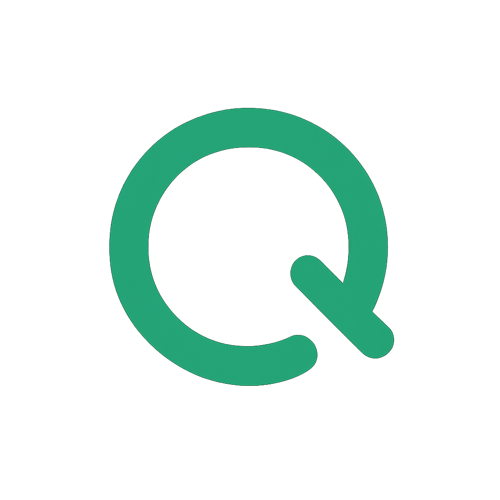

# Morchy



---

Morchy is a lightweight, stateless workloads orchestration platform built around a pull-model based node agents.

**Overview:**

- **Purpose:** Orchestrate short-lived workloads with a minimal control plane and pull-based agents.
- **Model:** Agents poll the API for work; the server remains stateless for easier scaling and deployment.

**Features:**

- **Stateless server:** Minimal runtime state on the control plane.
- **Pull-based workers:** Secure and resilient agent model that pulls tasks.

**Usecases:**

- [API](docs/usecases/api.md)
- [Agent](docs/usecases/agent.md)

**Quickstart**

Prerequisites:

- `docker` and `docker-compose` (recommended for quick local setup)
- `go` (for local development)

Run locally with Docker Compose:

```bash
docker-compose up --build
```

This will start the service and any required infrastructure defined in `docker-compose.yml`.

Run the app directly (development):

```bash
make start-controlplane-dev
```

```bash
make start-agent-dev
```

Environment:

- The service expects a PostgreSQL database. Provide the connection via an environment variable (e.g. `DATABASE_URL`).
- Other runtime configuration is read from environment variables; check `internal/infrastructure` and `internal/domain` for relevant keys.

**Development**

- Project layout highlights:
	- `cmd/` — application entrypoints (`cmd/app` for the server, `local` for local runner)
	- `usecase/` — use case handlers
	- `migrations/` — SQL migrations
	- `pkg/agent` — implementation of the node agent
	- `pkg/controlplane` - implementation of the control-plane

- Run Go tools and tests:

```bash
go test ./...
```
