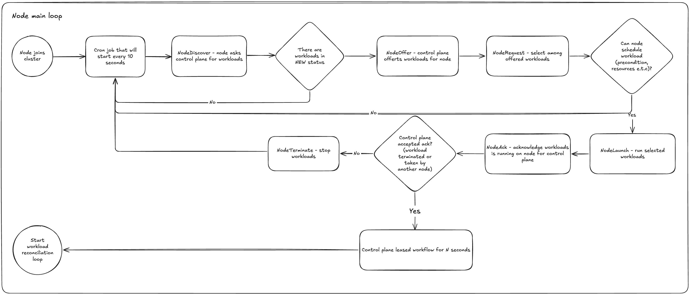
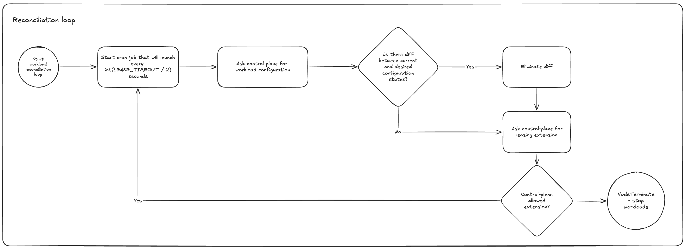

# Agent usecases

Agent component is deployed on runtime node and used to fetch, launch and reconcile workloads from control plane.

## Join loop

Main loop, that occurs on node agent start, it fetches available workloads from control plane, leases it and starts on node.

## Workload reconciliation

Workload reconciliation is used to ensure that workload is still healthy and running on node, after successful check it extends workload lease.

