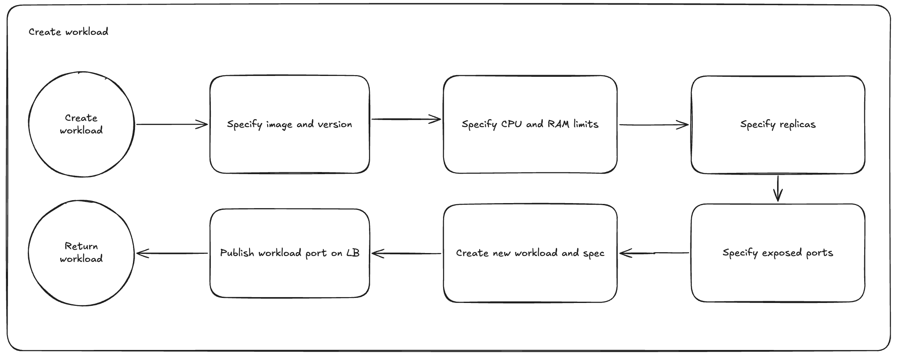
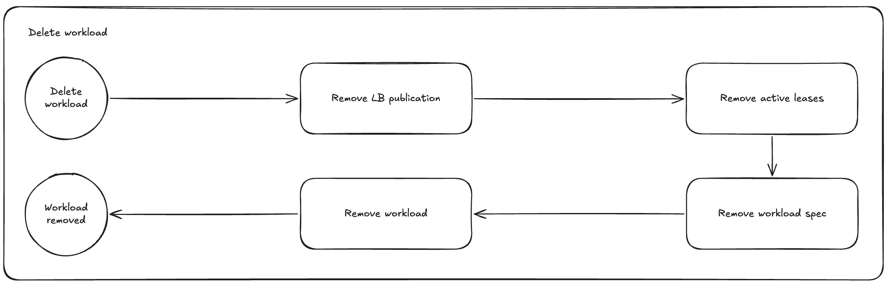

# Control plane usecases

Control plane is a component that is used to store user's workloads and expose them to node agents.

## Create workload

How workload is created by user, processed by control plane and stored in database.

## Delete workload

How workload decomission works after user's request.

